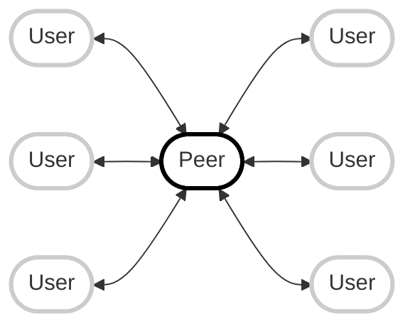

# PeerChat

## Bug Fixes and Improvements

- [ ] Fix issue with peer being disconnected seconds after joining a peer.
- [ ] Fix issue with peer ID being null during call initiation.
- [ ] Add better error handling.
- [ ] Implement push notifications.

**PeerChat** is a decentralized chat application designed for seamless communication over a local network. By leveraging peer-to-peer (P2P) technology, PeerChat enables users to connect directly without the need for an internet connection, making it ideal for environments where internet access is limited or unavailable, such as on a cruise ship or in a remote area.

## Features

- **Progressive Web App (PWA)**: PeerChat is a PWA, meaning it can be installed on your device for a native app-like experience with offline capabilities and push notifications.
- **Decentralized Communication**: PeerChat uses P2P connections to facilitate direct communication between devices, ensuring that conversations are private and secure.
- **Offline Functionality**: Designed to operate over a local WiFi network, PeerChat allows users to stay connected without relying on an internet connection.
- **Rich Media Support**: PeerChat supports text, audio, and video communication, offering a comprehensive suite of tools for staying in touch.
- **Intuitive User Interface**: The app features a user-friendly interface inspired by popular messaging platforms, making it easy to use for everyone.
- **Secure and Private**: With no central server, all communications are direct and encrypted, ensuring privacy and security.
- **Quick Setup**: Users can simply visit a URL, generate a QR code, and share it to connect with friends instantly.
- **Multiple User Support**: PeerChat supports multiple users, allowing for group chats and collaborative conversations.
- **Session Persistence**: Chats and calls are session-based and clear when you close the application, ensuring privacy as connections must be active to see messages.

